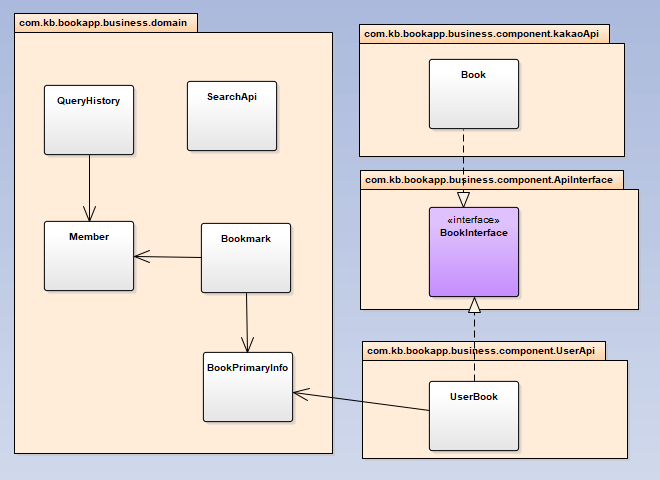

# Apps

## What is Apps?
> 다양한 API 서버를 이용한 자료 검색/추가/삭제 등의 기능을 지원하는 서비스입니다.

## Primary Skills
* Back-end
    * Spring-boot
    * Spring-security
    * Spring-data
    * JPA
    * Maven
* Front-end
    * ReactJS
    * Axios
    * Moment
    * Semantic-ui-React
    * Node-jsencrypt

## Features
* RESTFul API 를 사용한 자료 관리
    * 검색 - 페이지네이션, 소팅
    * 북마킹
* DB 를 사용한 자료 관리
    * 검색 - 페이지네이션, 소팅
    * 추가
    * 상세정보 열람
    * 북마킹
* 회원 기능
    * 회원 가입
    * 로그인 , 로그아웃 (JWT token 발급)
    * 암호화 (Client : PKCS#1 RSA encryption / Server : bcryp hash / Token : SHA-512)
* 기타
    * 검색 히스토리

## Primary Designs
### Package Design
- com.kb.bookapp : 베이스 패키지
    - app : 앱 전반에 걸친 설정과 글로벌 함수 / 상수를 패키지화
        - configuration
    - business : 비즈니스 요구사항이 반영된 패키지 목록
        - component
        - domain
        - service
    - presentation : 뷰와 비즈니스를 연결 시켜주는 상위 레이어
        - controller
        - exceptionHandler
        - filter
        - validator
    - repository  : 저장소 접근 레이어
        - custom

### Domain Design

- SearchApi : 데이터를 조회하는 API의 정보를 담고 있습니다.
- Member : 회원
- QueryHistory : 검색 히스토리
- Bookmark : 북마크 데이터
- BookPrimaryInfo : 주요 책 정보
- UserBook : 사용자 리포지터리 API에서 사용하는 책 엔티티
- Book : K API에서 사용하는 책 DTO

### Component Design (com.kb.bookapp.business.ApiInterface package)

- ComponentInterface : 저장소에 작용할 기능을 명세합니다.
- BookInterface : 도서가 제공해야하는 정보의 종류와 타입을 명세합니다.
- MetaInterface : 검색 결과가 가져야하는 정보의 종류와 타입을 명세합니다.
- SearchCondition : 검색 결과를 도출하기 위한 검색 조건을 캡슐화 합니다.
- SearchBookResult : 최종적인 검색 결과입니다.
- KakaoBookApiComponent : 카카오 도서 Api를 사용해 자료를 관리하는 RESTFul 요청을 작성합니다.
- UserBookApiComponent : 내부 데이터베이스를 사용해 자료를 관리하는 요청을 합니다.

> 여러분이 이 시스템을 확장해서 더 많은 저장소의 자료를 검색하고 싶다면 com.kb.bookapp.business.component.ApiInterface 패키지의 모든 interface를 구현해야합니다.
그리고 /back-end/initialize_sql.sql 파일에 다음과 같이 질의를 작성해주세요. 그 후 서버를 재기동 하면됩니다.

    INSERT INTO search_api (description, full_class_name, orders) VALUES ('사용자 Repository', 'com.kb.bookapp.business.component.UserApi.UserBookApiComponent', '1');
    // description : api의 이름
    // full_class_name : Componentinterface를 구현한 객체의 full class name
    // orders : view에서 보여질 순서

## 실행
> 프로젝트 루트(apps)폴더를 기준으로 다음 커맨드를 실행해주세요
> 사용하는 포트는 8080번과 3000번 입니다.

    // 커맨드 창을 두개 켜야합니다 ^_^;

    // 백엔드 빌드/실행 스크립트
    cd back-end && mvn clean install && mvn spring-boot:run

    // 프론트엔드 빌드/실행 스크립트
    cd ../front-end && npm install && npm start

## Access point
> http://localhost:3000